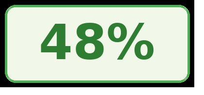
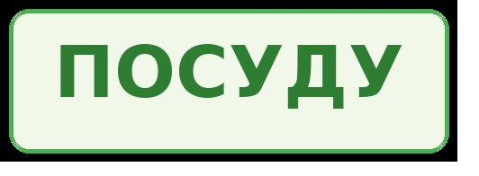
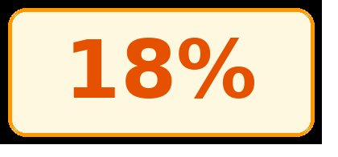
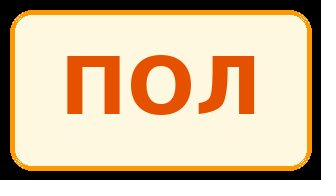
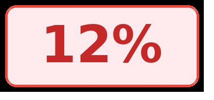
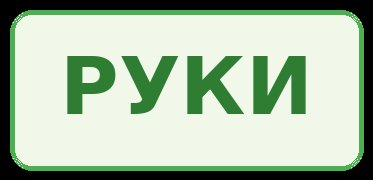
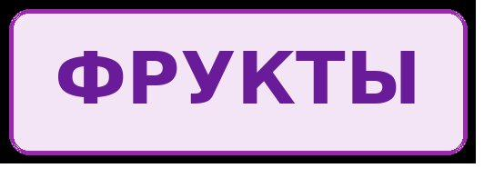
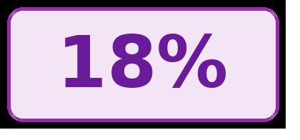
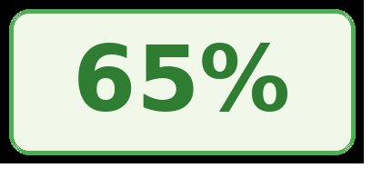

# Как работают трансформеры

**Авторский пересказ Lecture 1 курса Stanford CME 295 от Виктора Зайцева**

Это не дословный перевод лекции Шервина и Афшина Амиди. Это её пересказ моим голосом, для русскоязычных собственников бизнеса. Шервин с Афшином объясняют студентам Stanford с математикой и формулами. Я объясняю собственникам — чтобы понимали логику. Хронометраж в 4 раза меньше: без Q&A и академических отступлений.

**Оригинал лекции:** [CME 295 на cme295.stanford.edu](https://cme295.stanford.edu)
**Хронометраж:** 25–30 минут видео
**Формат:** моноспикер, чёрный фон, презентация на втором экране

---

## Содержание

1. [Вступление](#вступление)
2. [Что такое NLP](#что-такое-nlp)
3. [Три типа задач](#три-типа-задач)
4. [Токенизация — мама мыла раму](#токенизация--мама-мыла-раму)
5. [Векторы слов — король и королева](#векторы-слов--король-и-королева)
6. [RNN — как было раньше](#rnn--как-было-раньше)
7. [Почему RNN не справлялись](#почему-rnn-не-справлялись)
8. [Идея внимания](#идея-внимания)
9. [Q, K, V — словарь, ключ, значение](#q-k-v--словарь-ключ-значение)
10. [Архитектура трансформера](#архитектура-трансформера)
11. [Конкретный пример](#конкретный-пример)
12. [Что это для вас](#что-это-для-вас)
13. [Призыв к действию](#призыв-к-действию)

---

## Вступление

**🎬 На камеру, без презентации · ~1 мин 30 сек · 0:00**

Всем привет. Я Виктор Зайцев. 46 лет, 20 лет в бизнесе. 5 компаний с нуля.

Полтора года назад я решил разобраться как устроен искусственный интеллект. Не пользоваться — а понять что у него внутри. Зачем — расскажу в конце.

В рамках этого решения я прошёл курс Stanford. Называется CME 295. Трансформеры и большие языковые модели. Который читает Шервин Амиди.

Сегодня я не буду пересказывать вам академическую лекцию. Я возьму материал первой лекции этого курса и расскажу его так, как сам теперь понимаю. Чтобы вы, собственники, понимали что у вас под капотом когда вы пользуетесь Claude, ChatGPT, Gemini, любой моделью.

Это не про код. Не про математику. Это про логику. Поехали.

---

## Что такое NLP

**🎬 На презентации: «NLP — Natural Language Processing» · ~1 мин · 1:30**

Первая аббревиатура. **NLP**. Natural Language Processing. В переводе — обработка естественного языка.

Естественный язык — это тот на котором мы с вами говорим. Русский, английский, китайский. В отличие от языков программирования, где машина чётко понимает каждый символ.

Так вот. NLP — это когда мы заставляем машину работать с человеческим текстом. И задач здесь всего три категории. **Запомните — три.** Всё что машина может делать с текстом, попадает в одну из них.

---

## Три типа задач

**🎬 Презентация: три блока с примерами · ~3 мин · 2:30**

### Категория первая. Классификация

Машина смотрит на текст и выдаёт ответ из заранее заданного списка.

Пример. Клиент написал отзыв на ваш товар. Машина читает и говорит: позитивный отзыв, негативный или нейтральный. Всё. Один из трёх вариантов.

> 🎯 **Из жизни:** в моей мебельной компании это была бы фильтрация отзывов на маркетплейсах. Тысяча отзывов в неделю — глазами не прочитаешь. Машина их раскладывает по полочкам автоматически. Менеджер открывает только негативные и нейтральные — те, по которым нужно действовать.

### Категория вторая. Мульти-классификация

Машина смотрит на текст и помечает в нём несколько разных вещей.

Пример. Клиент пишет: «Заказал стол в Казани, доставка задерживается». Машина видит — здесь упомянуто три вещи: товар (стол), город (Казань), проблема (задержка доставки). И каждый кусочек помечает своим тегом.

Это нужно для автоматической маршрутизации обращений. Кому отдать жалобу — отделу доставки или отделу продаж. Машина решает за секунду.

### Категория третья. Генерация

Машина получает текст и выдаёт текст. Любой длины.

Это то, чем вы пользуетесь каждый день. ChatGPT, Claude, Gemini — это всё генерация. Перевод с русского на английский — генерация. Сводка длинного документа — генерация. Ответ на вопрос — генерация.

> ⚡ **Главное:** Все три категории работают на одной технологии — **трансформере**. Это та самая архитектура, которая в 2017 году перевернула всё. До этого делали по-разному. После — один подход на все три задачи.

---

## Токенизация — мама мыла раму

**🎬 На презентации: разбор фразы на токены · ~3 мин · 5:30**

Машина не понимает текст так как мы. Для неё буквы и слова — это просто цифры. Чтобы машина могла работать с предложением — его сначала надо разрезать.

Этот процесс называется **токенизация**. От слова «токен» — кусочек.

Берём предложение: «милый плюшевый мишка читает». Как мы его разрежем?

### Три способа

**Первый — по словам.** Каждое слово — один токен. Получаем четыре куска: «милый» / «плюшевый» / «мишка» / «читает». Просто, но есть проблема. Слова «мишка» и «мишки» — для машины это два разных токена. Хотя смысл один.

**Второй — по корням слов (subword).** Машина выделяет общую часть. «Мишк-» — один токен, «-а» и «-и» — окончания. Это умнее. Машина видит общий корень в «мишка» и «мишки». Большинство современных моделей работают именно так.

**Третий — по буквам.** Каждая буква — один токен. Защищён от опечаток («мишка» и «мшика» машина распознаёт). Но текста становится в десять раз больше, и работает медленно.

> 🎯 **Метафора:** Представьте грузчик, который должен разнести коробки по складу. Можно ему отдать ящики одним поддоном — быстро, но если внутри что-то не так, разбираться долго. Можно разбить на коробки — нормальный баланс. А можно вытащить каждый винтик отдельно — мелкая работа, медленно, но видишь каждую деталь. Третий способ — это посимвольная токенизация.

### Главный пример: мама мыла

А теперь главный пример который вы должны запомнить.

Я начинаю фразу: **«мама мыла...»** и обрываю.

Спросите у любого человека — что дальше? Скажет «раму». Потому что в школе все писали эту фразу.

А теперь спросите модель. Она тоже скажет «раму» — но не потому что в школе училась. Потому что у неё в обучающих данных эта фраза встречалась миллионы раз. И она просто **просчитала вероятность**.

<table>
  <tr>
    <td align="center"></td>
    <td align="center"></td>
  </tr>
  <tr>
    <td align="center"></td>
    <td align="center"></td>
  </tr>
  <tr>
    <td align="center"></td>
    <td align="center"></td>
  </tr>
  <tr>
    <td align="center"></td>
    <td align="center"></td>
  </tr>
  <tr>
    <td align="center"></td>
    <td align="center"></td>
  </tr>
</table>

Модель не «думает». Она считает — какое слово вероятнее всего идёт следующим. И выбирает то у которого процент выше.

А теперь покажу хитрость. Меняю начало фразы: **«Стоя у раковины, мама мыла...»**.

Что машина выдаст? Уже не «раму». Скорее всего — «посуду». Потому что у раковины обычно моют посуду, а не оконные рамы. Контекст изменил вероятности.

<table>
  <tr>
    <td align="center"></td>
    <td align="center"></td>
  </tr>
  <tr>
    <td align="center"></td>
    <td align="center"></td>
  </tr>
  <tr>
    <td align="center"></td>
    <td align="center"></td>
  </tr>
</table>

> ⚡ **Главное:** Языковая модель — это машина по предсказанию следующего слова на основе вероятностей. Всё что делает Claude или ChatGPT — это раз за разом предсказывает следующий токен. По одному за раз. Со скоростью сотни токенов в секунду.

---

## Векторы слов — король и королева

**🎬 На презентации: 3D-визуализация семантического пространства · ~3 мин · 8:30**

Машина разрезала текст на токены. Дальше каждому токену надо присвоить число. Точнее — **набор чисел**. Это называется вектор.

Простейший вариант — каждому слову свой номер. Слово «мишка» — номер 1, «книга» — номер 2, «милый» — номер 3. Не работает. Почему — сейчас покажу.

Дело в том, что машина должна понимать **сходство** между словами. «Милый» и «очаровательный» — близкие по смыслу. «Стол» и «стул» — близкие, оба мебель. «Король» и «королева» — близкие, оба монархи, но один мужчина, другая женщина.

Если просто пронумеровать слова — никакого сходства не видно. Слово 1 и слово 2 для машины такие же разные как 1 и 1000.

### Решение — Word2vec

В 2013 году придумали алгоритм **Word2vec**. Который представляет каждое слово не одним числом, а **набором из сотен чисел**. Этот набор называется **эмбеддинг**.

Что классно — слова которые встречаются в похожих контекстах, получают похожие эмбеддинги. Потому что машина обучается на огромном количестве текстов. Видит — «милый» и «очаровательный» часто стоят рядом со словом «мишка», значит они близкие.

> 🎯 **Метафора:** Это как карта города. На карте магазины электроники кучкуются в одном районе, рестораны в другом, школы в третьем. Так и эмбеддинги — слова со схожим смыслом находятся в одной «области». «Король», «королева», «принц», «принцесса» — все рядом. А «стол», «стул», «диван» — в другом районе.

### Знаменитый пример

Word2vec показал удивительную штуку. Машина понимает не просто близость слов, но и **отношения между ними**.

Берём вектор слова «король». Вычитаем вектор слова «мужчина». Прибавляем вектор слова «женщина». Получаем что? Вектор слова «королева».

**Король − мужчина + женщина = королева.**

То же самое работает с городами и странами. **Париж − Франция + Германия = Берлин.** Машина усвоила что Париж относится к Франции так же как Берлин относится к Германии. И может это вычислить как арифметику.

> ⚡ **Главное:** Это не магия. Это статистика. Машина увидела миллионы текстов где Париж упоминается рядом с Францией, а Берлин — с Германией. И в её математическом пространстве эти отношения сохранились как направления векторов.

---

## RNN — как было раньше

**🎬 На презентации: схема RNN с передачей скрытого состояния · ~2 мин 30 сек · 11:30**

До 2017 года для работы с текстом использовали другую архитектуру. **Рекуррентные нейронные сети.** По-английски RNN.

Как они работали. Берут предложение и обрабатывают слова **по одному**. Прочитали первое слово — запомнили. Прочитали второе слово — обновили память с учётом первого. Прочитали третье — обновили память с учётом первых двух. И так далее.

То есть на каждом шаге у машины есть «память о том что было до» — это называется **скрытое состояние**. И она использует эту память чтобы понять следующее слово.

> 🎯 **Метафора:** Это как читать книгу. Вы читаете первую главу. Помните её. Потом читаете вторую. К моменту третьей главы у вас в голове сюжет первых двух. Перед глазами только третья страница, но понимаете её в контексте всего прочитанного.

Технология была придумана ещё в 80-х. Но взлетела только в 2010-х, когда появились мощные компьютеры. До этого её просто негде было запустить.

В 90-х её улучшили — придумали **LSTM** (Long Short-Term Memory). Это RNN с дополнительной памятью. Машина может выборочно запоминать важное и забывать неважное.

Так работали все системы перевода, голосовые помощники, чат-боты **до 2017 года**.

---

## Почему RNN не справлялись

**🎬 На презентации: длинное предложение с отдалёнными зависимостями · ~2 мин · 14:00**

У RNN было два больших недостатка. Из-за которых их пришлось заменить.

### Проблема первая. Длинные тексты

Если предложение из десяти слов — RNN справляется. Если из ста — начинает забывать начало. Если из тысячи — забывает всё кроме последних двадцати слов.

Это называется проблема **исчезающего градиента**. Чем длиннее последовательность, тем хуже машина помнит что было в начале.

> 🎯 **Метафора:** Как игра в «испорченный телефон». Первый человек говорит фразу шёпотом второму, второй третьему, и так десять человек. К десятому смысл потерян. У RNN то же самое — память по цепочке размывается.

А теперь представьте перевод книги. Или анализ договора на сто страниц. Или поддержание контекста длинного разговора. RNN с этим не справлялась.

### Проблема вторая. Медленность

RNN обрабатывает слова **строго по очереди**. Сначала первое, потом второе, потом третье. Параллельно нельзя — следующее слово зависит от предыдущего.

А современные видеокарты, на которых считаются AI-модели, любят параллельные вычисления. Они могут одновременно обрабатывать тысячи операций. Но RNN им этого не давала — приходилось работать в одну ниточку.

> 💰 **Цифра:** Из-за этой особенности обучение крупной RNN на большом тексте могло занять недели. Современный трансформер обучается на тех же данных в десятки раз быстрее. Не за счёт компьютера — за счёт архитектуры.

---

## Идея внимания

**🎬 На презентации: линии-связи между словами в предложении · ~2 мин · 16:00**

В 2014 году появилась идея, которая всё изменила. Назвали её **attention**. По-русски — внимание.

Идея простая. Зачем тащить весь смысл предложения через цепочку памяти, если можно дать машине возможность **посмотреть напрямую** на любое слово из прошлого?

То есть машина обрабатывает текущее слово — и одновременно «оглядывается» на все предыдущие слова сразу. Не по цепочке через скрытое состояние. А напрямую.

> 🎯 **Метафора:** Это как разница между книгой и Википедией. Книгу вы читаете последовательно — страницу за страницей, ничего не пропустишь. В Википедии вы кликаете по ссылке и сразу попадаете в нужный раздел. Не надо проходить через всё что между. Attention — это «гиперссылки» внутри предложения.

### Главный прорыв — 2017

В 2017 году учёные из Google написали статью с провокационным названием. **«Attention Is All You Need»** — «Внимание это всё что вам нужно».

В ней они сказали: давайте вообще откажемся от рекуррентных сетей. Оставим **только** механизм внимания. Никаких цепочек, никакой последовательной обработки. Каждое слово напрямую связано с каждым другим.

Эта архитектура называется **трансформер**. И она лежит в основе всех современных моделей. ChatGPT — трансформер. Claude — трансформер. Gemini — трансформер. LLaMA, DeepSeek, Mistral — все трансформеры.

> ⚡ **Главное:** Запомните 2017 год и название «Attention Is All You Need». Это момент когда родился весь современный искусственный интеллект который вы сейчас используете. До этой статьи AI работал по-другому. После — все строят одну и ту же архитектуру.

---

## Q, K, V — словарь, ключ, значение

**🎬 На презентации: пример с поиском в словаре · ~3 мин · 18:00**

Теперь покажу как внимание работает внутри. Здесь всего три буквы — **Q, K, V**. Запомните их.

- **Q (Query)** — запрос. Что я ищу.
- **K (Key)** — ключ. Под каким ярлыком хранится информация.
- **V (Value)** — значение. Сама информация.

> 🎯 **Метафора:** Это как библиотечный каталог. Вы приходите и говорите: «Нужна книга про мебельный бизнес». Это ваш **запрос (Q)**. Библиотекарь идёт к ящикам с карточками. Каждая карточка — это **ключ (K)**. На карточке написано: «Производство мебели», «Дизайн интерьера», «Маркетинг для дизайнеров». Библиотекарь сравнивает ваш запрос с ключами, выбирает наиболее подходящие. И достаёт книги — это **значения (V)**.

### Как это работает в трансформере

Каждое слово в предложении превращается в **три копии** — Q, K и V.

Когда модель обрабатывает слово, она берёт его Q (запрос) и сравнивает с K (ключами) всех остальных слов в предложении. Те слова, чьи ключи лучше всего подходят к запросу — получают высокий вес. От них модель берёт V (значения) и складывает.

На выходе — новое представление слова, обогащённое информацией от тех слов, которые с ним связаны.

Пример. В предложении «мишка милый и пушистый, он лежит на диване» — слово «он» должно понимать что относится к слову «мишка». Через механизм Q-K-V модель видит: запрос «он» лучше всего сочетается с ключом «мишка». Берёт от «мишки» значение. И уже знает — он = мишка.

> ⚡ **Главное:** Это можно делать **одновременно для всех слов**. Не по цепочке как в RNN. Каждое слово сразу видит каждое другое. Все связи строятся за один проход. Видеокарты от этого в восторге — это идеальная задача для параллельных вычислений.

---

## Архитектура трансформера

**🎬 На презентации: схема трансформера — encoder + decoder · ~2 мин 30 сек · 21:00**

Теперь общая картина. Классический трансформер из статьи 2017 года состоит из двух частей.

### Encoder — кодировщик

Принимает входной текст. Например, английскую фразу для перевода. Разбивает на токены. Превращает в векторы. Прогоняет через несколько слоёв внимания. На выходе — обогащённое представление каждого слова, учитывающее весь контекст.

### Decoder — декодировщик

Получает от encoder это обогащённое представление. И начинает **генерировать выход** по одному токену. На каждом шаге декодировщик смотрит:

- Что уже выдал на предыдущих шагах (своя история)
- Что в исходном тексте от encoder (что нужно перевести)

На основе этих двух источников он выбирает следующее слово. Потом следующее. Пока не выдаст специальный токен «конец предложения».

### Важное уточнение

В современных языковых моделях типа ChatGPT и Claude **encoder выбросили**. Оставили только decoder.

Почему? Потому что для чата не нужно «понять текст и потом ответить». Нужно просто продолжать генерировать текст. Decoder с этим справляется и в одиночку — он сам смотрит на весь предыдущий контекст разговора и выдаёт следующее слово.

> ⚡ **Главное:** Все современные LLM — это **decoder-only** трансформеры. Encoder используют там где нужно понять текст, например в моделях типа BERT для классификации отзывов или поиска. Но генеративные модели — только decoder.

---

## Конкретный пример

**🎬 На презентации: пошаговая визуализация генерации фразы · ~2 мин · 23:30**

Пройдём по живому примеру. Вы пишете в Claude: «Переведи на английский: милый плюшевый мишка читает».

Что происходит внутри.

1. Модель разбивает вашу фразу на токены
2. Каждый токен превращает в вектор
3. Добавляет к каждому информацию о его позиции в предложении (это называется **position encoding**)
4. Прогоняет через несколько слоёв с механизмом внимания — каждое слово получает контекст всего предложения
5. Начинает генерировать ответ. Первый токен — какой? Считает вероятности. **«A»** — высокая вероятность (английские предложения часто начинаются с артикля).
6. Выдаёт «A». Теперь у неё контекст: ваш вопрос + первое слово ответа. Считает следующий токен. **«cute»**.
7. Дальше: «A cute». Следующий — **«teddy»**.
8. Дальше: «A cute teddy». Следующий — **«bear»**.
9. Дальше: «A cute teddy bear». Следующий — **«is»**.
10. Потом «reading». Потом точка. Потом специальный токен «конец генерации».

На каждом шаге модель проходит через ту же самую архитектуру. Считает вероятности всех возможных следующих слов. Берёт наиболее вероятное.

Скорость на современных моделях — сотни таких шагов в секунду. Вы видите как ответ появляется по слову — это и есть генерация в реальном времени.

---

## Что это для вас

**🎬 На камеру, без презентации · ~2 мин · 25:30**

Зачем я вам это всё рассказал.

Каждый из вас пользуется Claude или ChatGPT. Но большинство — как чёрным ящиком. Спросил — получил. А если ответ так себе — жмёшь «попробовать снова» в надежде что повезёт.

Теперь когда вы понимаете что внутри — вы можете работать с моделью **по-партнёрски**. И ответы становятся в разы лучше. Покажу как.

### Раз. Контекст решает всё

Раз модель предсказывает следующее слово на основе всего что было раньше — значит чем больше **релевантного** контекста вы ей даёте, тем точнее ответ.

**Плохо:** «Напиши пост». Машина сгенерирует общий пост ни о чём.

**Хорошо:** «Напиши пост для собственников мебельных компаний, которые хотят автоматизировать работу с клиентами. Аудитория — мужчины 40+ из регионов. Тон — без воды, с конкретными цифрами. Длина 200 слов». Машина выдаст в разы более точный результат.

### Два. Модель не «знает» — она «считает»

Это объясняет почему Claude иногда выдумывает факты. Он не «знает» что такое-то событие было в таком-то году. Он считает что вероятнее всего идёт после фразы «это событие произошло в». И иногда вероятность ошибочна.

Поэтому факты которые критичны — всегда проверяйте. Особенно цифры, имена, даты. Это не недостаток модели — это её принцип работы.

### Три. Один запрос = одна задача

На каждом шаге генерации модель помнит весь контекст. Если в одном запросе попросить «составь план маркетинга, напиши пост в Инстаграм, и заодно посчитай бюджет на рекламу» — она пойдёт по проторенной дороге и часть проигнорирует.

Разбивайте на отдельные запросы. Получите три отдельных качественных ответа вместо одного скомканного.

> ⚡ **Главное:** Понимание архитектуры — это не для гика. Это для собственника, который хочет получать от AI в три раза больше пользы за то же время. Знаете как машина «думает» — формулируете запросы по-другому. Качество результата прыгает мгновенно.

---

## Призыв к действию

**🎬 На камеру, прощание · ~1 мин · 27:30**

Я перевожу этот курс на русский. Шпаргалки уже выложены на моём GitHub — ссылки в описании. Прохожу его сам, перевожу по ходу, и делюсь со всеми бесплатно.

Параллельно делаю книгу по этому курсу совместно с автором — Шервином из Stanford. Это займёт несколько месяцев, но результат будет первым русским переводом этого материала вообще.

Если хотите получать такие разборы регулярно — подписывайтесь на канал. Если кому интересно глубже — пишите в комментариях, какие темы разобрать следующими. Читаю я. На связь выйду.

### До скорых встреч

Сегодня мы разобрали как работают трансформеры. В следующих видео разберём как сделать так чтобы Claude или ChatGPT работали на ваш бизнес. Без программистов. За 10 тысяч рублей в месяц. На вашем компьютере.

---

## Ссылки

- **Оригинальная лекция:** [CME 295 Lecture 1](https://cme295.stanford.edu)
- **Перевод шпаргалки CME 295 на русский:** [github.com/ilyazaitsev17/stanford-cme-295-transformers-large-language-models](https://github.com/ilyazaitsev17/stanford-cme-295-transformers-large-language-models)
- **Канал «ИИ на практике»:** [vkvideo.ru/@vz_ai](https://vkvideo.ru/@vz_ai)

## Авторство

- **Сценарий и интерпретация:** Виктор Зайцев, канал «ИИ на практике»
- **Оригинальный материал:** Шервин Амиди (Stanford) и Афшин Амиди (MIT), курс Stanford CME 295

Опубликовано под лицензией [MIT](../../LICENSE). Используйте свободно с указанием авторства.
