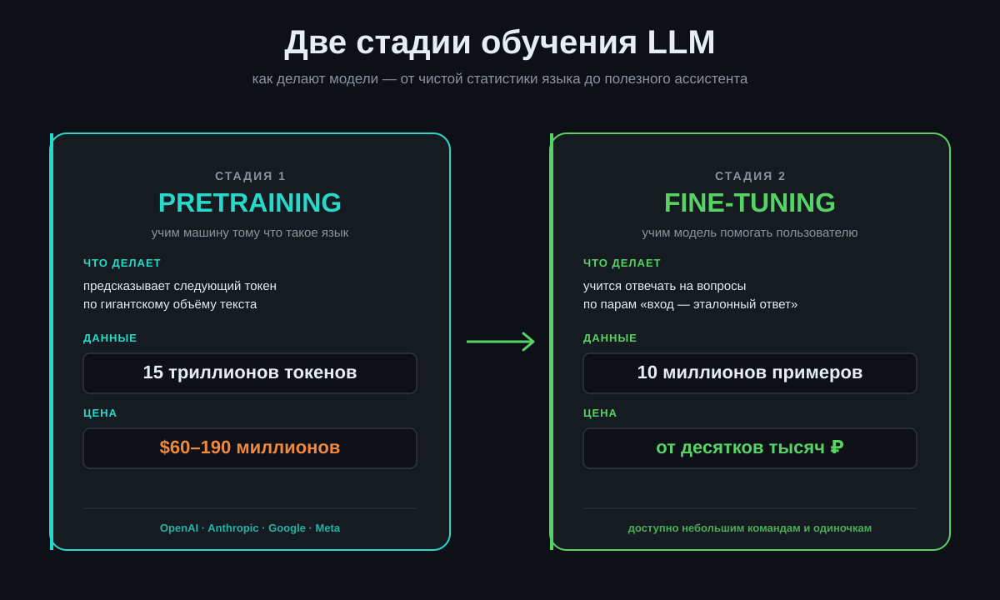
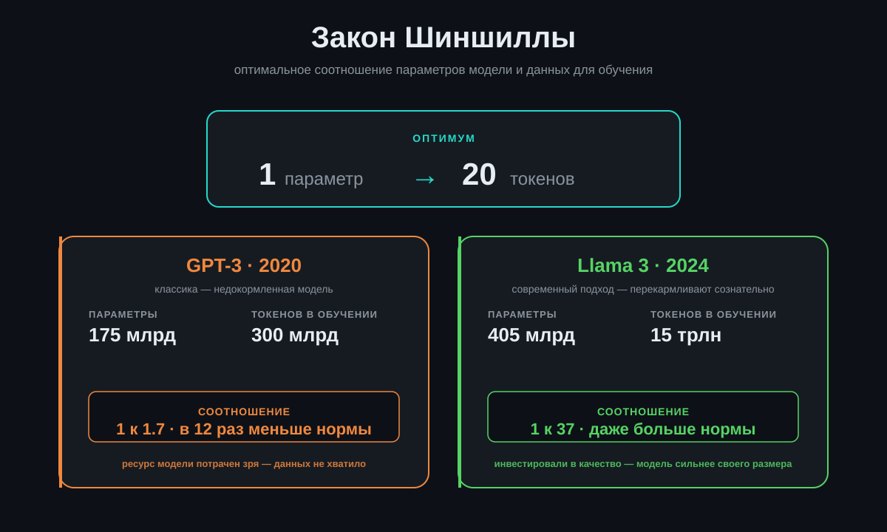
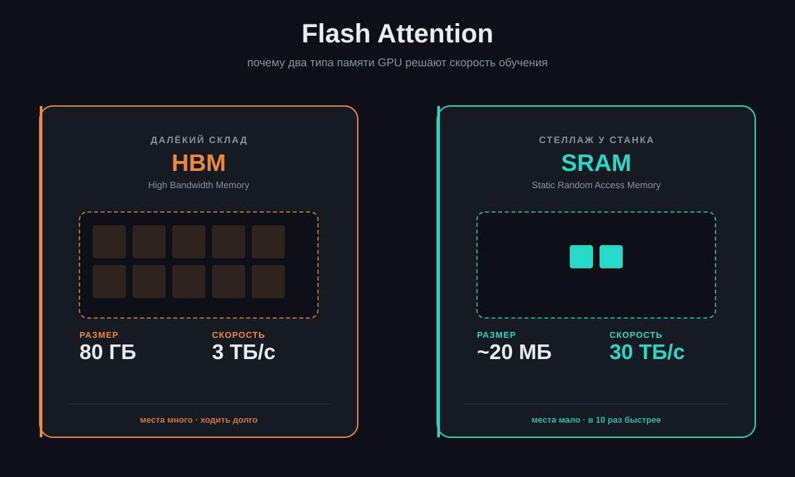
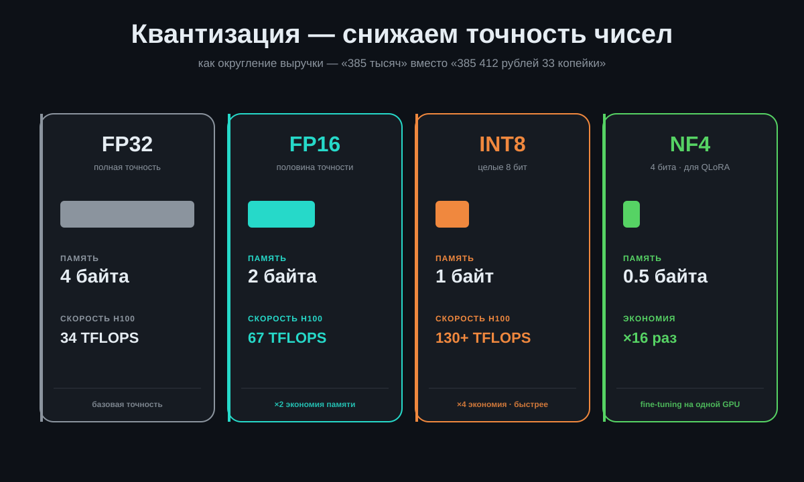
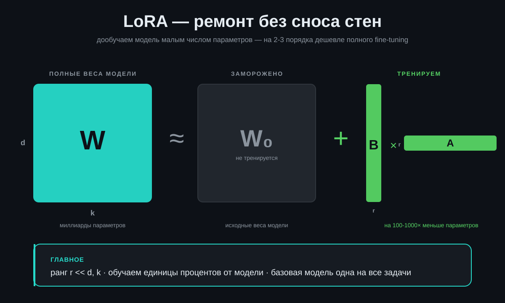

# Лекция 2 — Как обучают большие языковые модели

**Хронометраж:** ~28 минут
**Источник:** Stanford CME 295, Lecture 4 · по материалам Шервина и Афшина Амиди
**Статус:** сценарий готов, схемы готовы, можно записывать

---

## Содержание

1. [Всем привет](#01-всем-привет)
2. [Модель делают в две стадии](#02-модель-делают-в-две-стадии)
3. [Что такое pretraining](#03-что-такое-pretraining)
4. [На каких данных её учат](#04-на-каких-данных-её-учат)
5. [FLOPs — единица счёта](#05-flops--единица-счёта)
6. [Закон Шиншиллы — 20 к 1](#06-закон-шиншиллы--20-к-1)
7. [Сколько это стоит и knowledge cutoff](#07-сколько-это-стоит-и-knowledge-cutoff)
8. [Почему одной видеокарты мало](#08-почему-одной-видеокарты-мало)
9. [Бригада грузчиков — data parallelism](#09-бригада-грузчиков--data-parallelism)
10. [Конвейер — model parallelism](#10-конвейер--model-parallelism)
11. [Flash Attention — близкий и далёкий склад](#11-flash-attention--близкий-и-далёкий-склад)
12. [Квантизация — где нужна точность](#12-квантизация--где-нужна-точность)
13. [Учим помогать — SFT](#13-учим-помогать--sft)
14. [Безопасность — продавец, который не продаёт оружие](#14-безопасность--продавец-который-не-продаёт-оружие)
15. [Как меряют модели](#15-как-меряют-модели)
16. [LoRA — ремонт без сноса стен](#16-lora--ремонт-без-сноса-стен)
17. [Что это значит для бизнеса](#17-что-это-значит-для-бизнеса)
18. [До скорых встреч](#18-до-скорых-встреч)

---

## 01. Всем привет

На связи Виктор Зайцев, канал «ИИ на практике». В прошлый раз разобрали как устроены трансформеры. Сегодня — как их обучают.

Это второе видео из серии по курсу Stanford CME 295. Курс читают Шервин и Афшин Амиди — те же ребята, с которыми мы сейчас делаем книгу на русском. Материал свежий, читался осенью 2025-го.

Видео для тех кто хочет понимать что происходит внутри ChatGPT, Claude, Gemini. Не чтобы программировать. Чтобы принимать решения как предприниматель: что покупать, что не покупать, что можно тюнить под свой бизнес, а что нет.

Берите, пользуйтесь. Все ссылки в описании.

---

## 02. Модель делают в две стадии

Большая ошибка думать что модель — это одно длинное обучение. Нет. Это две разные стадии. И они радикально отличаются по стоимости, по данным, по тому что делают.

Зачем такое разделение? **Транспортные расходы.** Если бы каждый раз когда нужна модель под спам-фильтр или под анализ отзывов мы учили её с нуля — это было бы как заново строить завод чтобы выпустить одну партию стульев. Дешевле один раз построить завод и переналаживать линию.

Pretraining — это завод. Fine-tuning — переналадка под конкретную задачу.

---

## 03. Что такое pretraining

Берёшь огромный кусок данных — практически весь интернет. И учишь модель одной простой задаче: **предсказывай следующее слово**.

Помните пример из первого видео — «мама мыла…»? Модель учится для любого начала фразы выдавать вероятности следующего слова. Раму, посуду, пол, руки. Учится не правилам грамматики. Учится статистике языка.

> **Главное про pretraining**
> На этой стадии модель не знает что она ассистент. Она не понимает что значит «помогать пользователю». Она знает только одно: как продолжить любой текст так чтобы это было похоже на то что пишут люди.

Если такой *сырой* модели задать вопрос — «можно ли постирать плюшевого мишку в машинке?» — она не даст совет. Она додумает фразу. Может ответить: «…и какой режим выбрать для деликатных тканей». Может вообще уйти в сторону.

Это не баг. Это её работа на этой стадии — продолжать текст. До помощника ей ещё далеко.

---

## 04. На каких данных её учат

Главный источник — Common Crawl. Это организация которая ходит по всему интернету и складывает копии страниц в архив. Три миллиарда страниц в месяц. Огромная свалка текстов.

Плюс к этому — Википедия, Reddit, GitHub, Stack Overflow, форумы. Тексты на разных языках, код на разных языках программирования.

Размер измеряют в токенах. Токен — это кусочек слова, мы про это говорили в первой лекции.

- **GPT-3** — `300 миллиардов токенов` · вышла в 2020
- **Llama 3** — `15 триллионов токенов` · вышла в 2024

За четыре года объём данных вырос в пятьдесят раз. И на этом не остановится.

Для понимания масштаба: 15 триллионов токенов — это примерно 11 триллионов слов. Если человек читает книгу в день — 300 слов в минуту, 8 часов чтения — это 144 тысячи слов в день. Чтобы прочитать столько же сколько Llama 3 — нужно 200 тысяч лет непрерывного чтения.

---

## 05. FLOPs — единица счёта

Когда говорят сколько модель «съела» вычислений — называют цифру в FLOPs. С маленькой «s». Это floating point operations. Сколько операций с дробными числами модель сделала за всё обучение.

Для современной большой модели — `10 в 25 степени` FLOPs. Десять септиллионов операций. Цифра неподъёмная для воображения.

Есть похожее слово — **FLOPS**, с большой «S». Это уже скорость: сколько операций в секунду делает железо. Когда смотрите характеристики видеокарты — там стоит FLOPS. У H100 — 34 терафлопа на самой точной арифметике.

> **Запоминаем**
> FLOPs (объём) ≈ количество параметров × количество токенов. Грубо. Это означает: чем больше модель и чем больше данных — тем дороже обучение. Линейно по каждому из множителей.

---

## 06. Закон Шиншиллы — 20 к 1

До 2022 года считали так: чем больше параметров — тем умнее модель. Делали гигантские модели, кормили относительно небольшим объёмом данных.

В 2022 году DeepMind опубликовал исследование. Они проверили десятки вариантов: разные размеры моделей, разные объёмы данных, фиксированный бюджет компьютера. И нашли закономерность.

Что это значит на примере. GPT-3 — 175 миллиардов параметров. По Шиншилле должно быть 3,5 триллиона токенов. А обучили на 300 миллиардах. То есть GPT-3 — *недокормленная*. В одиннадцать раз меньше данных чем оптимально.

Сравните: Llama 3 — 405 миллиардов параметров и 15 триллионов токенов. Это уже соотношение 37 к 1. Перекормили — это сознательное решение Meta, чтобы модель была сильнее при том же количестве параметров.

Меня всегда удивляет когда люди говорят «купим самую большую модель и решим все проблемы». Размер модели — это только половина уравнения. Без правильного объёма данных большая модель будет хуже маленькой.

---

## 07. Сколько это стоит и knowledge cutoff

Pretraining — самая дорогая часть. Цифры публичные.

- **GPT-4** — оценка обучения `$60–100 миллионов`
- **Llama 3 405B** — оценка `$60+ миллионов` только на электричество и аренду GPU
- **Gemini Ultra** — `$190+ миллионов`

Это не считая зарплат команд, инфраструктуры, экспериментов которые не пошли в финальный релиз. Реальные бюджеты в два-три раза выше.

Сюда же приклеивается вторая проблема. Когда обучение закончилось — у модели появилась **дата отсечки знаний**. Knowledge cutoff. Это дата на которой остановили сбор данных.

Дальше модель уже не знает что происходило в мире. У GPT-5 cutoff — сентябрь 2024-го. У Claude Opus 4.7 — конец января 2026-го. У Llama 3 — декабрь 2023-го. После этой даты модель ничего не знает.

> **Аналогия из жизни**
> Это как сотрудник, который уволился в апреле и потом сидит дома. Спросишь его про майские события — пожмёт плечами. Дообучить можно. Но дорого. Поэтому проще *дать ему доступ к интернету* — это называется RAG, retrieval. Об этом — отдельное видео.

---

## 08. Почему одной видеокарты мало

Когда модель учится — нужно держать в памяти видеокарты не только сами веса. Ещё кучу всего:

- **Веса модели** — собственно параметры
- **Активации** — что выдал каждый слой на проходе вперёд
- **Градиенты** — в какую сторону крутить каждый параметр
- **Состояние оптимизатора** — Adam помнит средние градиенты по истории

На большую модель это десятки и сотни терабайт памяти. У одной самой топовой видеокарты H100 — `80 гигабайт`. Это меньше чем нужно в тысячу раз.

> **Главная инженерная задача обучения**
> Как разрезать модель и данные между тысячами видеокарт так, чтобы они дружно работали и при этом не тратили всё время на пересылку данных между собой.

На этом построена половина инженерии современных AI-компаний. Дальше — три главных приёма как это делают.

---

## 09. Бригада грузчиков — data parallelism

Первый приём — **data parallelism**. Параллелизм по данным.

Идея простая. Берём 8 одинаковых видеокарт. На каждую кладём *копию всей модели*. И делим данные на 8 кусков — каждой карте свой кусок.

Это как бригада грузчиков. У каждого свой пикап с товаром. Каждый разгружает независимо. В конце смены сверяют итоги — «у меня столько-то, у меня столько-то, среднее значение такое». И обновляют общий план.

Плюсы: можно обработать в 8 раз больше данных за то же время. Минусы: модель должна целиком влезть в одну видеокарту. И есть *цена связи* — карты обмениваются градиентами в конце каждого шага. Чем больше карт — тем больше времени уходит на болтовню между ними.

> **ZeRO — оптимизация для больших моделей**
> Если у каждого грузчика в кармане одна и та же накладная — это глупо. Накладная лежит у одного. Остальные смотрят в его карман. Применили эту идею к моделям — назвали **ZeRO**, Zero Redundancy Optimizer. Делят между картами не только данные, но и состояние оптимизатора, градиенты, иногда и сами веса. Памяти экономится в разы. Платим — увеличенным трафиком между картами.

---

## 10. Конвейер — model parallelism

Второй приём — **model parallelism**. Когда сама модель уже не влезает в одну карту — её режут на части.

Три варианта.

- **Pipeline parallelism** — конвейер. Слои 1–8 на первой карте, слои 9–16 на второй, и так далее. Данные проходят последовательно. Как сборочный конвейер ВАЗа: первый ставит двери, второй ставит стёкла.
- **Tensor parallelism** — режут саму операцию умножения матриц на куски. Половина матрицы на одной карте, половина на другой. Считают параллельно, потом склеивают.
- **Expert parallelism** — для моделей где есть «эксперты». Каждого эксперта кладём на свою карту. Когда приходит вопрос — система решает кому из экспертов его передать.

На практике большие модели обучают комбинацией *всех трёх*. И ещё накладывают сверху ZeRO. Это уже не инженерия — это балет тысяч видеокарт.

---

## 11. Flash Attention — близкий и далёкий склад

Это отдельная история, которую обязательно надо рассказать. Придумали в Стэнфорде в 2022 году. Сейчас используют везде.

Внутри видеокарты есть два типа памяти. Большая и далёкая — HBM. Маленькая и быстрая — SRAM. Это как у тебя на производстве есть большой склад на окраине города и маленький стеллаж прямо возле станка.

Стандартный механизм внимания (attention) работает так: тащит большие матрицы с дальнего склада, перемножает, кладёт обратно. Снова тащит, считает softmax, кладёт обратно. Снова тащит — умножает на матрицу значений. И так далее.

Куча беготни между ближним и дальним складом. Видеокарта простаивает в ожидании данных.

> **Идея Flash Attention**
> Резать матрицы на маленькие куски. Эти куски целиком отправлять на ближний стеллаж. Считать там *всё от начала до конца*. Складывать только готовый результат на дальний склад. Минимум поездок.

Результат — обучение в разы быстрее. Память меньше расходуется. Сейчас уже Flash Attention 2 и Flash Attention 3 — адаптации под новые видеокарты.

Что важно: эта оптимизация — *точная*. Никаких приближений. Результат побитово такой же как у обычного attention. Просто умнее расположили вычисления по памяти.

---

## 12. Квантизация — где нужна точность

Веса модели — это числа с десятичной точкой. По умолчанию хранятся в формате FP32 — 32 бита на число. Можно посчитать 7 цифр после запятой.

А нужно ли столько? Когда ты в магазине считаешь выручку за день — пишешь «385 тысяч». Не «385 412 рублей 33 копейки». Точности хватает.

Та же логика для модели. Можно урезать точность с 32 бит до 16, до 8, иногда до 4 бит. Это называется **квантизация**.

В чём фокус. Видеокарты считают *быстрее* на коротких числах. У H100 на FP32 — 34 терафлопа. На FP16 — уже 67 терафлопов. На FP8 — 130 терафлопов. Двойной выигрыш: меньше памяти и быстрее счёт.

> **Mixed precision — гибридная стратегия**
> Хранят веса в высокой точности (FP32). Но все промежуточные вычисления делают в низкой (FP16). Когда обновляют веса — снова в высокой. Так точность не теряется, а скорость растёт в разы.
> Интуиция простая. Сами расчёты могут быть приблизительными — данные и так шумные, плюс-минус не страшно. Но накопительный итог по весам надо хранить точно — иначе ошибки складываются и модель деградирует.

---

## 13. Учим помогать — SFT

Окей. Pretraining закончен. У нас есть модель которая знает язык, но как ассистент бесполезна — она продолжает текст, а не отвечает на вопросы.

Вторая стадия — **fine-tuning**. По-русски — дообучение. Берём специальный набор примеров: *вход — правильный ответ*. И учим модель именно по таким парам.

| Вопрос пользователя | Эталонный ответ |
|---|---|
| Можно ли постирать плюшевого мишку в стиральной машине? | Лучше постирать вручную в тёплой воде с мягким моющим средством. В машинке мишка может потерять форму и наполнитель собьётся. |

Таких пар собирают десятки тысяч. По всем мыслимым задачам — написать письмо, составить план, написать код, объяснить термин, отказать вежливо, дать совет.

Этот этап называется **instruction tuning** — обучение следовать инструкциям. После него модель из «продолжателя текста» становится «ассистентом».

**Сравнение объёмов:**
- Pretraining: 15 триллионов токенов
- SFT: 10 миллионов примеров (примерно 10 миллиардов токенов)

Разница в полторы тысячи раз. И стоимость — на порядки ниже. Поэтому fine-tuning можно делать своими руками. Pretraining — нельзя.

Данные для SFT раньше писали полностью люди — эксперты-лингвисты сочиняли образцовые ответы. Сейчас всё чаще используют *другие модели* для генерации обучающих примеров. Человек только проверяет качество. Так быстрее и дешевле.

---

## 14. Безопасность — продавец, который не продаёт оружие

Часть обучения уходит на то чтобы модель отказывалась от вредных запросов. Как сделать бомбу, как взломать банкомат, как написать вирус — она должна сказать «извини, не могу».

Это *не цензура поверх*. Это вшито в саму модель на этапе fine-tuning. Через примеры: «вот такой запрос — вот такой отказ».

> **Аналогия с бизнеса**
> Это как продавец в магазине. Его задача — продавать. Помогать покупателю. Но если человек просит коктейль Молотова — продавец должен отказать. Это не значит «продавец плохой». Это значит «продавец взрослый».

Тонкость в том, что модели иногда перестраховываются. Откажут даже там, где запрос нормальный. Это раздражает. С этим борются — но идеального баланса нет ни у кого.

Помните: помощь должна быть полезной **и безвредной**. По-английски — helpful and harmless. Если будет только полезной — модель напишет вирус. Если только безвредной — будет на каждый вопрос отвечать «не могу помочь». Балансируют между этими двумя.

---

## 15. Как меряют модели

Когда обучение закончено — нужно понять насколько модель хороша. Тут начинается отдельная боль.

Есть два подхода. Оба несовершенные.

**Первый — бенчмарки.** Набор стандартных тестов. MMLU — пятьдесят разных предметов школьно-университетского уровня. GSM8K — математика средней школы. HumanEval — задачи по программированию. И ещё десятки.

Проблема в том, что модели начинают *натаскивать на тест*. Как ребёнок которого готовят к ЕГЭ. Сам предмет знает плохо, но конкретные задачи прорешает. Появился даже термин «training on the test task» — обучают на типе задач из теста, а потом меряют результат на этом же тесте. Сильно завышенные цифры.

**Второй — Chatbot Arena.** Сайт где живые пользователи задают вопросы. Получают два ответа от разных моделей вслепую. Голосуют какой лучше. Из миллионов голосов считают рейтинг.

Тоже не идеально. Люди голосуют за то что им *нравится*, а не за то что правильно. Если в ответе есть смайлики — половина проголосует «лучше». А смайлики могут быть неуместны. А если модель аккуратно отказала отвечать — пользователь обидится и поставит «хуже».

> **Что отсюда забрать**
> Не верь одной цифре. Когда выбираешь модель под свою задачу — тестируй её на *своих реальных запросах*. Сравнение по бенчмаркам показывает общую тенденцию. Подходит ли модель именно тебе — решается практикой.

---

## 16. LoRA — ремонт без сноса стен

Допустим тебе нужна модель которая хорошо отвечает в стиле твоей компании. Или умеет работать с твоим прайс-листом. Или знает специфику твоей отрасли — например, мебельной.

Полный fine-tuning всей модели — это всё равно дорого. Миллионы параметров, тонна железа.

Есть приём проще — называется **LoRA**. Low-Rank Adaptation. Расскажу что это.

> **Аналогия с ремонтом**
> Представь у тебя квартира. Большой ремонт — это сносить стены, менять трубы, бить полы. Дорого, долго, сложно. А есть косметический — переклеить обои, заменить мебель, перекрасить двери. Делается за пару недель и стоит в десять раз меньше.
> **LoRA — это косметический ремонт модели.**

Технически: оригинальные веса модели *замораживают*. Не трогают вообще. Добавляют маленькие тренируемые матрицы — буквально на пару процентов от размера оригинала. Учат только их.

Что в итоге. Параметров тренируется в сто, а то и в тысячу раз меньше. Времени и денег — тоже на порядки меньше. Хранить дообученную версию — это сохранить только эти маленькие матрицы. Базовая модель остаётся одна на всех.

Делаешь под спам-фильтр — одна LoRA-добавка. Под клиентскую поддержку — другая. Под анализ договоров — третья. Базовая модель — одна. Это меняет экономику дообучения радикально.

**QLoRA — двойная экономия.** Поверх LoRA накладывают **квантизацию**. Базовую модель сжимают до 4 бит на параметр. А маленькие тренируемые матрицы оставляют точными. Так fine-tuning большой модели становится возможен *на одной видеокарте*. Сэкономили память в 16 раз. По сравнению с обычным fine-tuning большой модели — экономия в сотни раз.

---

## 17. Что это значит для бизнеса

Я не просто так разбираю эту лекцию. Хочу чтобы вы поняли практическую сторону.

- **Pretraining своей модели — не для нас.** Это десятки миллионов долларов. Этим занимаются OpenAI, Anthropic, Google, Meta. Брать их готовые модели через API — единственный реалистичный путь.
- **Fine-tuning под свою задачу — реально.** Через LoRA на готовой open-source модели типа Llama. Бюджет — десятки тысяч рублей за серьёзное дообучение. Несколько недель работы одного специалиста.
- **Своя модель под отрасль — имеет смысл когда?** Когда у тебя есть много примеров «вопрос — правильный ответ» именно по твоей теме. Юридическая фирма с базой решений. Сервис поддержки с архивом тикетов. Магазин с историей консультаций.
- **Чаще всего хватает не fine-tuning, а RAG.** Подсунуть модели твою базу знаний в момент запроса. Это дешевле и проще. Об этом будет отдельное видео.

> **Контраст «тогда vs сейчас»**
> Три года назад дообучить модель под свой бизнес — это годовой проект, команда из пяти человек, бюджет от двух миллионов рублей. Сегодня — один человек, две недели, бюджет до ста тысяч. При этом качество выше.
> Это не я придумал. Это арифметика по LoRA + QLoRA + готовые open-source модели.

---

## 18. До скорых встреч

Сегодня разобрали как обучают LLM. Две стадии — pretraining и fine-tuning. Закон Шиншиллы 20 к 1. Как параллелят между тысячами видеокарт. Flash Attention, квантизация, LoRA.

В следующем видео разберём **RAG** — как заставить модель работать с твоей базой знаний. Без обучения. Без дообучения. На том что уже есть из коробки.

Шпаргалки по этому курсу — на моём GitHub. Параллельно делаю с авторами книгу на русском, это первый полный перевод Stanford CME 295 — будет к лету. Подписывайтесь на канал — там анонсы.

Если интересно глубже — пишите в комментариях, какие темы разобрать следующими. Читаю я. На связь выйду.

До скорых встреч.

---

*Сценарий подготовлен 27 мая 2026 · По материалам Stanford CME 295 Lecture 4*
*Канал «ИИ на практике» · Виктор Зайцев*
